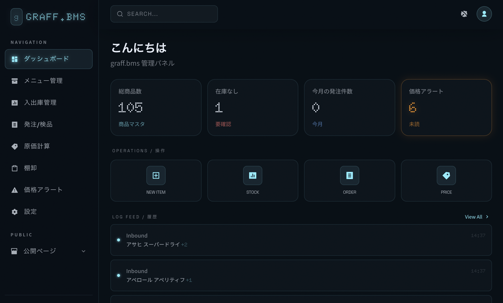
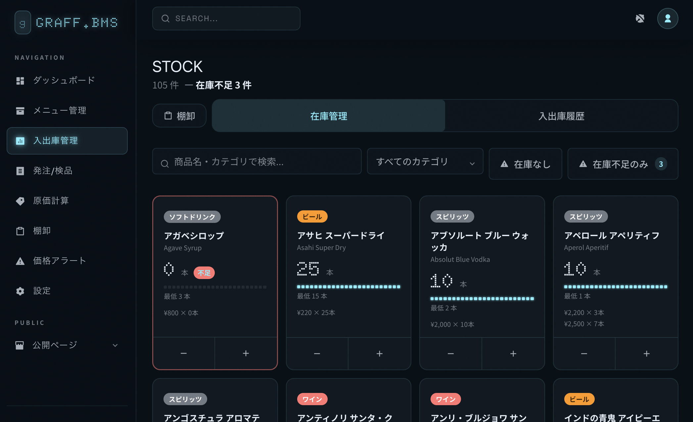
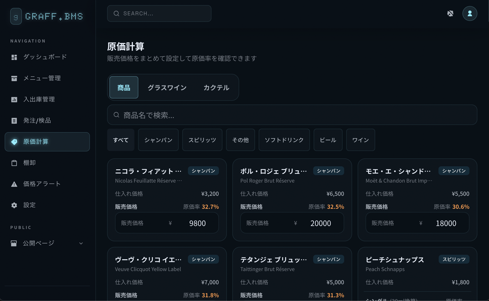
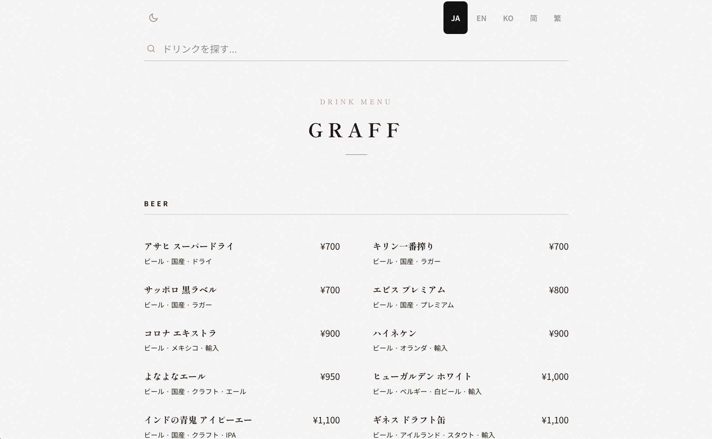

# graff.bms

Bar Management System — バー向けのオールインワン在庫・発注・メニュー管理システム。


**[Live Demo](https://graff-bms.vercel.app/admin)** — 認証なしで全機能を試せます

---

## Screenshots

| Dashboard | Stock |
|-----------|-------|
|  |  |

| Pricing | Public Menu |
|---------|-------------|
|  |  |

---

## Features

- **メニュー管理** — 商品・カクテル・グラスワインをカテゴリ別に管理。在庫切れの自動非表示に対応
- **入出庫管理** — FIFO ロット管理。楽観的 UI で快適な操作感
- **発注 / 検品** — カートから業者別の発注書を一括作成。品目ごとの検品フロー付き
- **発注書印刷** — A4 印刷対応の発注書ページ
- **棚卸し** — セッション管理 + パスワード承認フロー。差異は自動で在庫調整
- **原価計算** — 商品・グラスワイン・カクテルの原価率を一覧表示
- **価格アラート** — 仕入れ価格が 5% 以上上昇した際に自動通知（DB トリガー）
- **公開メニュー** — 多言語対応（日本語 / English / 한국어 / 中文）の顧客向けメニューページ。QR コードで簡単にアクセス

---

## Tech Stack

| Layer | Technology |
|-------|-----------|
| Framework | Next.js 16 (App Router) + React 19 |
| Database | Supabase (Postgres + Auth + Storage) |
| Styling | Tailwind CSS v4 + CSS Custom Properties |
| i18n | next-intl (5 locales) |
| Hosting | Vercel (Tokyo region) |
| Language | TypeScript |

---

## Getting Started

### 1. Prerequisites

- Node.js 20+
- [Supabase](https://supabase.com) プロジェクト

### 2. Clone & Install

```bash
git clone https://github.com/yukiyashimoda/graff_bms.git
cd graff_bms
npm install
```

### 3. Environment Variables

`.env.local` を作成して以下を設定する。

```env
NEXT_PUBLIC_SUPABASE_URL=https://your-project.supabase.co
NEXT_PUBLIC_SUPABASE_ANON_KEY=your-anon-key
SUPABASE_SERVICE_ROLE_KEY=your-service-role-key
STORAGE_BUCKET=your-bucket-name

# オプション: 月次トランザクション一括削除の保護パスワード
BULK_DELETE_PASSWORD=your-password
```

### 4. Database Setup

Supabase CLI がインストール済みの場合:

```bash
# プロジェクトをリンク
supabase link --project-ref your-project-ref

# マイグレーションを適用
supabase db push

# （任意）ダミーデータを投入
supabase db reset --db-url your-db-url < supabase/seeds/mock_data.sql
```

CLI なしで手動セットアップする場合は、`supabase/migrations/` 内の SQL ファイルを番号順に Supabase SQL Editor で実行してください。

### 5. Start Development Server

```bash
npm run dev
```

| URL | 内容 |
|-----|------|
| `http://localhost:3000/admin` | 管理画面 |
| `http://localhost:3000/ja` | 公開メニュー（日本語） |
| `http://localhost:3000/en` | 公開メニュー（English） |

---

## Project Structure

```
src/
├── app/
│   ├── [locale]/           # 公開メニュー（ISR 30秒）
│   └── admin/(protected)/  # 管理画面ルート群
├── components/admin/       # UI コンポーネント
├── hooks/                  # useAsyncAction / useToast / useSearchFilter
└── lib/
    ├── supabase/           # Supabase クライアント
    ├── ui.ts               # デザイントークン
    ├── format.ts           # 表示フォーマット関数
    └── revalidate.ts       # revalidatePath 集約
```

詳細なアーキテクチャ・DB スキーマ・実装意図については [`README_DEV.md`](./README_DEV.md) を参照してください。

---

## Scripts

```bash
npm run dev        # 開発サーバー起動
npm run build      # プロダクションビルド
npm run lint       # ESLint
npm run db:types   # Supabase の型定義を再生成
```

---

## Deployment

[Vercel](https://vercel.com) へのデプロイを推奨します。

1. GitHub リポジトリを Vercel にインポート
2. 環境変数（上記 4 項目）を Vercel ダッシュボードで設定
3. デプロイ

`vercel.json` により東京リージョン (`hnd1`) が自動的に選択されます。

---

## Contributing

Issues / Pull Requests を歓迎します。

---

## License

MIT — see [LICENSE](./LICENSE)
